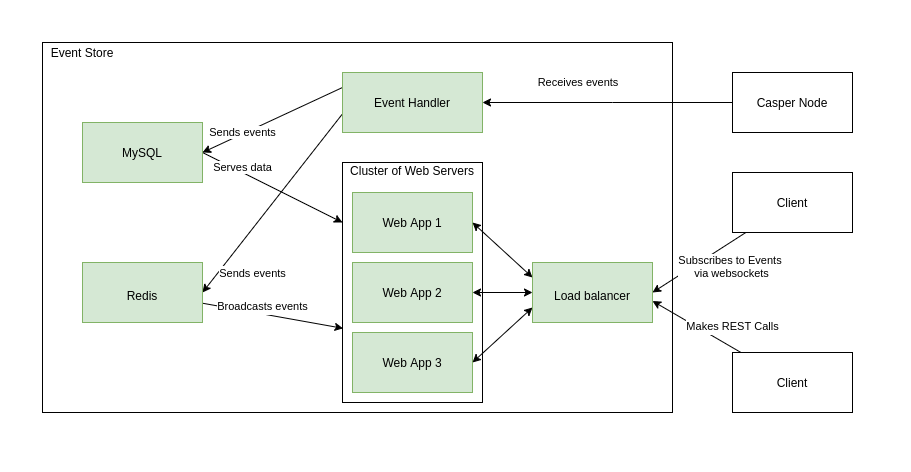

# Casper Event Store

## High Level View



## Event Handler

Event Handler is a program that is responsible for:

- Reading events from Casper Node. It requires constantly open HTTP connection.
- Retrying Casper Node connection if it drops.
- Parsing events and sending them to the database using direct connection.

systemd should supervise the Event Handler and restart it if required.

## Event Store

Event Store is a standard web server. It offers:

- REST calls with filtering and pagination.
- WebSockets with subscriptions and filters.
- Horizontal scaling.

Supported models:

- Blocks
- Deploys
- Accounts

### Web App

Web App is written in [Express.js](https://expressjs.com/).

### Database

As a database we use MySQL. It can be easily set in the master-slave config, so each instance of a Web App has its own read-only instance. Only the instance, that populates data from the Event Handler needs write access.

Storage should be designed, so it doesn't store duplicated events.

For the sake of testing it should be possible to use in-memory db.

### Horizontal Scaling

Scaling is done by having multiple instances of a Web App. Incoming traffic is equally distributed among WebApps. To communicate with all the connected clients via websockets Redis is used as a PubSub mechanism.

## CI/CD

The code should be fully tested. Docker images should allow to start:

- All-in-one instance for local testing and development.
- Cluster mode for deployment.

## Installation

```bash
npm install
```

## Testing

```bash
npm test
```

## Event Store - Usage

For the development it is possible to run the server in two modes: with and without mock data.

To run server with empty database:

```
npm run dev-start-web-server
```

To run server with mock data:

```
npm run dev-start-web-server-with-mock-data
```

## Event Store - REST Endpoints

| Possible HTTP Status Code | Description |
| --- | --- |
| 200 | Correct request to the existing resources. |
| 404 | Correct request to the not-existing resources. |
| 400 | Incorrect request, which is probably wrong URL. |

### /block/\<string>

Get the information about a single block.

```bash
$ curl -s localhost:3000/block/block1_6409191316db2ad075bf005cba502e2a46f83102bceb736356a9c51111 | jq
{
  "blockHash": "block1_6409191316db2ad075bf005cba502e2a46f83102bceb736356a9c51111",
  "parentHash": "16815a580c3c1005a7df485e77e31c89e5fb1dec4d57988ffb29f1e699977414",
  "timestamp": "2020-10-08T12:11:35.808Z",
  "eraId": 163,
  "proposer": "01d28e8ac5e5a02512c134fecb5cde43755b59d4616e109a4afd6c4f908bf82606",
  "state": "added",
  "height": 1800,
  "deploys": [
    "deploy1_0fb356b6d76d2f64a9500ed2cf1d3062ffcf03bb837003c8208602c5d3",
    "deploy2_6fb356b6d76d2f64a9500ed2cf1d3062ffcf03bb837003c8208602c5d3"
  ]
}
```

### /blocks?page=\<int>&limit=\<int>

Get the paginated list of blocks starting from the latest block. Pagination is supported via `page` and `limit` parameters. `limit` sets how many elements should be included on the page. By default `limit=10` and `page=1`. The response contains additional information about total number of pages `pageCount`, total number blocks `itemCount` and `pages` that can be turned into pagination bar on the frontend.

```bash
$ curl -s localhost:3000/blocks?limit=2 | jq
{
  "data": [
    {
      "blockHash": "block3_09191316db2ad075bf005cba502e2a46f83102bceb736356a9c51111",
      "parentHash": "aacd466409191316db2ad075bf005cba502e2a46f83102bceb736356a9c51111",
      "timestamp": "2020-10-08T12:13:35.808Z",
      "eraId": 163,
      "proposer": "01d28e8ac5e5a02512c134fecb5cde43755b59d4616e109a4afd6c4f908bf82606",
      "state": "added",
      "height": 1802,
      "deploys": [
        "deploy3_0fb356b6d76d2f64a9500ed2cf1d3062ffcf03bb837003c8208602c5d3"
      ]
    },
    {
      "blockHash": "block2_09191316db2ad075bf005cba502e2a46f83102bceb736356a9c51111",
      "parentHash": "aacd466409191316db2ad075bf005cba502e2a46f83102bceb736356a9c51111",
      "timestamp": "2020-10-08T12:12:35.808Z",
      "eraId": 163,
      "proposer": "01d28e8ac5e5a02512c134fecb5cde43755b59d4616e109a4afd6c4f908bf82606",
      "state": "added",
      "height": 1801,
      "deploys": []
    }
  ],
  "pageCount": 2,
  "itemCount": 3,
  "pages": [
    {
      "number": 1,
      "url": "/blocks?limit=2&page=1"
    },
    {
      "number": 2,
      "url": "/blocks?limit=2&page=2"
    }
  ]
}
```

### /deploy/\<string>

Get the information about a single deploy.

```bash
$ curl -s localhost:3000/deploy/deploy3_0fb356b6d76d2f64a9500ed2cf1d3062ffcf03bb837003c8208602c5d3 | jq
{
  "deployHash": "deploy3_0fb356b6d76d2f64a9500ed2cf1d3062ffcf03bb837003c8208602c5d3",
  "account": "1234501c47ed20a9ec40a899ddc7b51a15db2a6c55041313eb0201ae04ee9bf932",
  "state": "processed",
  "cost": 12,
  "errorMessage": null,
  "blockHash": "block3_09191316db2ad075bf005cba502e2a46f83102bceb736356a9c51111"
}
```

### /accountDeploys/\<string>?page=\<int>&limit=\<int>

Get the paginated list of deploys for an account starting from the latest block. Pagination is supported via `page` and `limit` parameters. `limit` sets how many elements should be included on the page. By default `limit=10` and `page=1`. The response contains additional information about total number of pages `pageCount`, total number deploys `itemCount` and `pages` that can be turned into pagination bar on the frontend.

```bash
$ curl -s localhost:3000/accountDeploys/010c801c47ed20a9ec40a899ddc7b51a15db2a6c55041313eb0201ae04ee9bf932?page=1&limit=10
{
  "data": [
    {
      "deployHash": "deploy1_0fb356b6d76d2f64a9500ed2cf1d3062ffcf03bb837003c8208602c5d3",
      "account": "010c801c47ed20a9ec40a899ddc7b51a15db2a6c55041313eb0201ae04ee9bf932",
      "state": "processed",
      "cost": 11,
      "errorMessage": null,
      "blockHash": "block1_6409191316db2ad075bf005cba502e2a46f83102bceb736356a9c51111"
    },
    {
      "deployHash": "deploy2_6fb356b6d76d2f64a9500ed2cf1d3062ffcf03bb837003c8208602c5d3",
      "account": "010c801c47ed20a9ec40a899ddc7b51a15db2a6c55041313eb0201ae04ee9bf932",
      "state": "processed",
      "cost": 12,
      "errorMessage": null,
      "blockHash": "block1_6409191316db2ad075bf005cba502e2a46f83102bceb736356a9c51111"
    }
  ],
  "pageCount": 1,
  "itemCount": 2,
  "pages": [
    {
      "number": 1,
      "url": "/accountDeploys/010c801c47ed20a9ec40a899ddc7b51a15db2a6c55041313eb0201ae04ee9bf932?page=1&limit=10"
    }
  ]
}
```

## Config

There are three configuration files that lives in `config` directory.

- `config/db-config.json` is the database configuration.
- `config/eh-config.json` is used by the Event Handler to specify the URL of the Node's `/events` endpoint.
- `config/web-config.json` is used by the Event Web Server to specify its host and port.

## Docker Setup

### Event Handler

Event handler needs to have the connectivity with the database and the Node.

##### Build

```
docker build . -f Dockerfile.handler -t event_handler
```

##### Run

```
docker run -it -v $PWD/config:/app/config event_handler
```

### Event Web Server

Event Web Server needs to have the connectivity with the database (and soon Redis).

##### Build

```
docker build . -f Dockerfile.web_server -t event_web_server
```

##### Run

```
docker run -it -v $PWD/config:/app/config event_web_server
```
